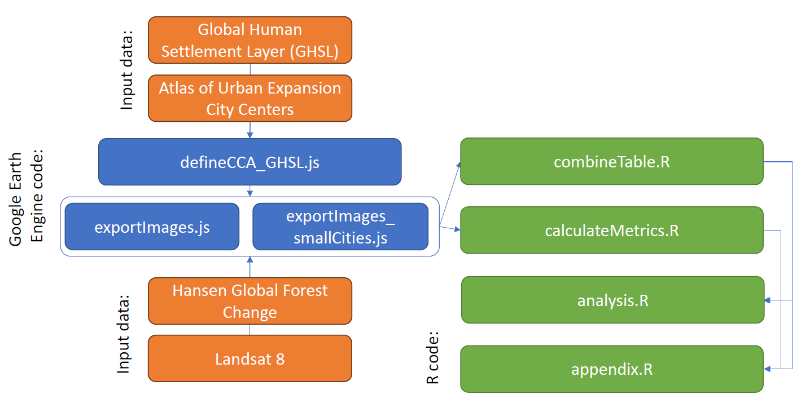

# As cities grow larger, they may also become less green
Using Landsat and other publicly available satellite-derived data, this research tests whether urban green space exhibits scaling relationships on a global selection of 150 cities at global and individual city scales. We find that urban green space follows a pervasive sublinear scaling relationship with city size, both in terms of population and land area.

## Citation:
Stuhlmacher, M., Frazier, A.E., Corya, I., and Yang, W. (Under Review). “As cities grow larger, they may also become less green”. Journal of Land Use Science.

## Methodology Diagram:

